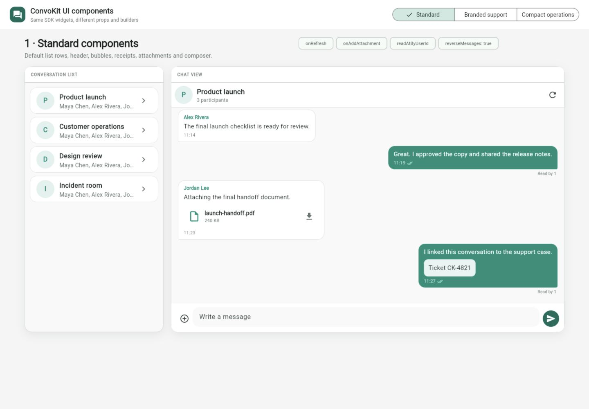
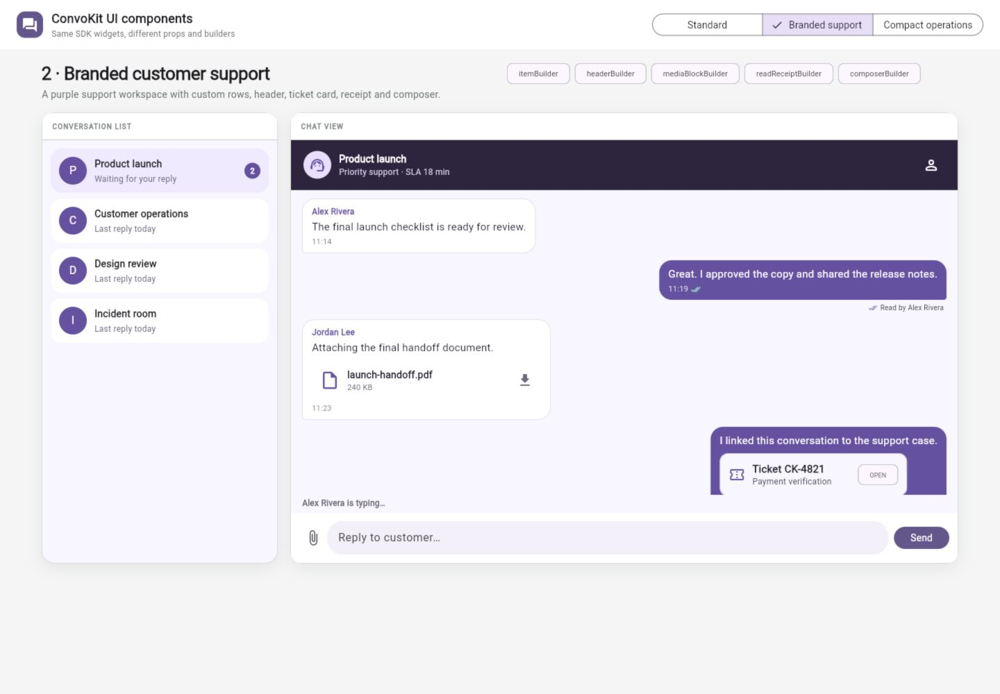
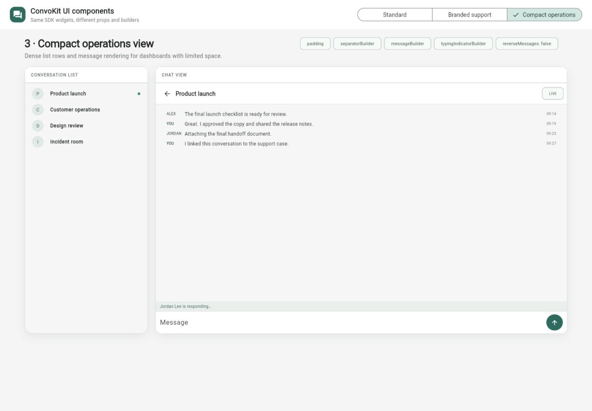

# ConvoKit Flutter UI examples

Public, runnable examples showing how an application can configure
[`convokit_flutter_ui`](https://pub.dev/packages/convokit_flutter_ui) without
copying or modifying the package source.

This repository contains application code only. The examples depend on the
published `convokit_flutter_ui` and `convokit_flutter` packages.

## Component showcase

The default entry point uses local fixture data, so it runs without a backend,
client ID, or client secret:

```bash
flutter pub get
flutter run -d chrome
```

Use the selector in the app to compare the configurations. On Flutter web,
append `?variant=standard`, `?variant=branded`, or `?variant=compact` to open a
specific configuration.

The web runner is checked in; no `flutter create` step is needed. To produce a
static build of the fixture-only showcase:

```bash
flutter build web --release
```

Serve `build/web` through an HTTP server. The showcase does not issue tokens or
contact a ConvoKit backend. For hosting below a subdirectory, pass the matching
`--base-href=/your/path/` when building.

### Standard components



Package defaults plus `onRefresh`, `onAddAttachment`, `readAtByUserId`, and
`reverseMessages: true`.

### Branded customer support



A support treatment built with `itemBuilder`, `headerBuilder`,
`mediaBlockBuilder`, `readReceiptBuilder`, and `composerBuilder`.

### Compact operations



A dense dashboard built with custom padding, separators, message rows, typing
indicator, composer, and `reverseMessages: false`.

The complete configuration is in
[`lib/showcase/component_showcase_app.dart`](lib/showcase/component_showcase_app.dart),
and its widget tests are in
[`test/component_showcase_test.dart`](test/component_showcase_test.dart).

## Live SDK-backed example

[`lib/live_example.dart`](lib/live_example.dart) demonstrates the minimal
SDK-backed conversation list and selected conversation flow. It expects a
public client ID and a token endpoint that keeps the client secret on its
server:

```bash
flutter run -d chrome -t lib/live_example.dart \
  --dart-define=CONVOKIT_CLIENT_ID=public-client-id \
  --dart-define=CONVOKIT_TOKEN_ENDPOINT=https://app.example.com/api/convokit-token
```

The managed `https://api.convokit.app` endpoint is automatic. Add
`--dart-define=CONVOKIT_BACKEND_URL=...` only for local testing or self-hosting.

Never put a ConvoKit client secret in Flutter application code or
`--dart-define` values.

## Verification

```bash
dart format --output=none --set-exit-if-changed lib test
flutter analyze
flutter test
flutter build web --release
flutter build web --release -t lib/live_example.dart --output build/web-live
```

CI compiles both entry points. Without the live configuration defines, the
second build displays configuration help and does not connect; compilation is
not a live backend or Realtime acceptance test.
